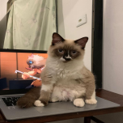

## 🚀 Quest HMTL e CSS
Excercício de HTML e CSS do FrontEnd Mentor - huddle page - realizado para a QUEST do curso DevQuest

## 🗺 Visão Geral do Projeto

- Visão Desktop

- Visão Mobile

## 📝 Proposta do Projeto

- A proposta deste projeto era recriar da maneira mais parecida possivel a página de uma marca ficticia, utilizando as tecnologias HMTL e CSS

## 🗻 Desafios no Caminho

- Por se tratar do meu primeiro projeto feito inicialemente do zero tive muita dificuldade para começar, fazia perguntas como "Por onde começo, oque faço, ou oque escrevo" mas, seguindo as dicas, consegui me concentrar e destrinchar a página em etapas fazendo assim um planejamento gradual de como funcionaria a construção da página.

 

(Meu primeiro rascunho para o Layout)

 

- Outra dificuldade que encontrei pelo caminho foi em relação a poscionamento de itens, porém, após alguns minutos "codando" me acostumei e o projeto fluiu normalmente

- Falando especificamente de clean code, tentei revisar ao máximo meu código para deixa-lo o mais limpo e reduzido possivel 

- Por ultimo mas não menos importante (inclusive é muito importante) o desafio que me restava era somente a tão temida responsividade, mas felizmente assim como os outros desafios não demorei muito para entender o ponto principal do problema e resolve-lo por partes

## 🔧 Ferramentas Utilizadas

- Este projeto foi desenvolvido utilizando somente as tecnologias:

    
    

## 🎯 Considerações Finais

- O projeto foi muito desafiador no começo pelo motivo de ser aprimeira interação com uma produção feita essencialmente do zero, mas acredito que alcancei a proposta e o objetivo, acrescentando a minha expêriencia e curriculo como se portar diante de um projeto.

## 👥 Autores

Contribuição: Código

- [@CariokacomK] (https://github.com/CariokacomK)

 

Contribuição: Fofura e Tecladas aleatorias durante o código:

- Paulo

